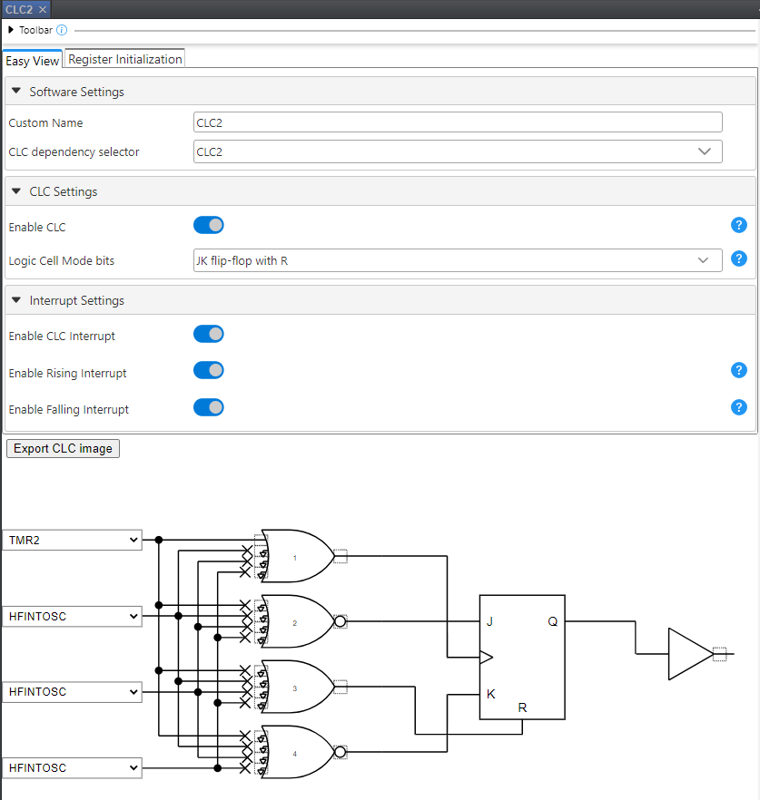
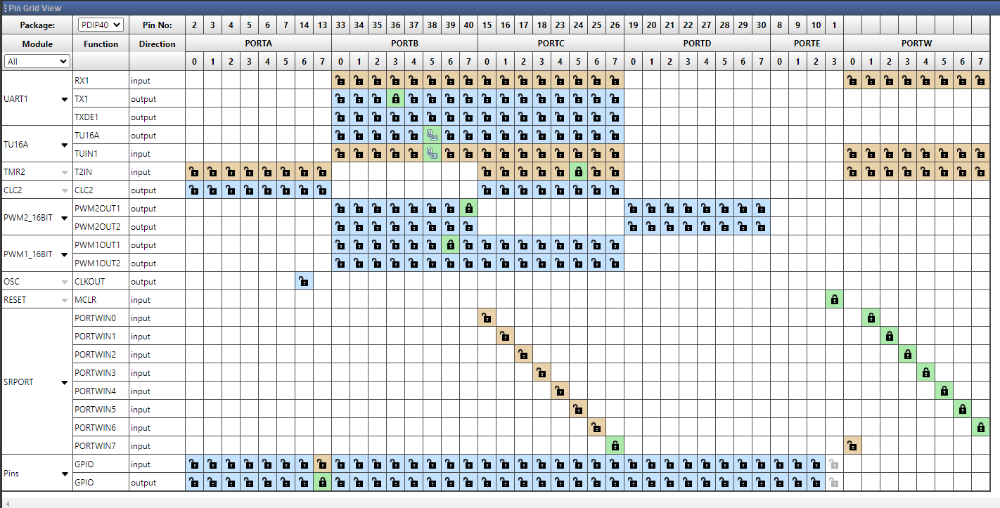

# SIPO Shift Register Using Signal Routing Port

This project highlights the advanced core-independent peripherals found on the PIC18-Q71 family of devices to create a Serial-In, Parallel-Out shift register. This project implements the Signal Routing Port (SRPORT) module to shift and store the incoming data based on a clock signal. The Direct Memory Access (DMA) module is used to transfer data between peripherals and the memory core-independently without any CPU intervention. PWM modules are used to generate clock and data signals. The UART module is used to transmit data on the serial bus.

 

## Related Documentation

For more details and code examples on the PIC18F46Q71 click on the following links:

- [PIC18F46Q71 Product Page](https://www.microchip.com/en-us/product/pic18f46q71)
- [Using the Signal Routing Port Module on 8-bit PIC® Microcontrollers](https://www.microchip.com/en-us/application-notes/tb3322)

## Software Used

- [MPLAB® X IDE  v6.15 or newer](http://www.microchip.com/mplab/mplab-x-ide)
- [MPLAB® XC8 v2.45 or newer](http://www.microchip.com/mplab/compilers)
- [PIC18F-Q_DFP v1.22.413 or newer Series Device Pack](https://packs.download.microchip.com/)

## Hardware Used

- [Curiosity High Pin Count (HPC) Development Board](https://www.microchip.com/en-us/development-tool/dm164136)

## Shift Register
Shift registers are important digital components that can be used to store and transfer data. A Serial-In Parallel-Out (SIPO) shift register can be used in applications where data buffering or data acquisition based on a clock is needed. A SIPO shift register consists of multiple flip flops chained together in series with data and clock signals as inputs. In this code example, the parallel output is stored as bytes of data in memory. A block diagram of a basic SIPO shift register is shown below:
 

## 1. Setup

The following peripheral configurations are set up using MPLAB® Code Configurator (MCC) Melody for the PIC18F46Q71:

 

- **SRPORT**
 In this code example, the Signal Routing Port module is used to shift and store data based on an incoming clock signal. The SRPORT is configured as a shift register by internally connecting the output of each signal routing pin to the input of the previous signal routing pin.
 

  The value of the signal is stored and shifted at each rising edge of the clock signal. After each eight clock cycles, an eight-bit value representing the data signal (for the previous eight clock cycle time frame) is stored in the PORTW register. The value of the PORTW register should be read or transferred to memory before the next rising edge of the clock. The timing diagram of a SIPO shift register is shown below:
   

   Module configuration:
  - PORTW Clock: Enabled
  - Clock Source: CLC1_OUT
  - Data Flip Flops: Enabled
  - PORTWIN0: RW1
  - PORTWIN1: RW2
  - PORTWIN2: RW3
  - PORTWIN3: RW4
  - PORTWIN4: RW5
  - PORTWIN5: RW6
  - PORTWIN6: RW7
  - PORTWIN7: RC7 (Physical pin RC7 is used as input to the SRPORT module)
   

- **UART1:**
 The UART module is used to transfer the stored data through the serial BUS. The Virtual COM Port on the Curiosity development board is used to transfer data to the terminal. The DMA2 module is used to load the UART transmit buffer with the stored data.
  - UART PLIB Selector: UART1
  - Requested Baudrate: 115200
  - Parity: None
  - Data Size: 8
  - Stop Bits: 1
  - Redirect Printf to UART: Enabled

- **UART1PLIB:**
  - Enable UART: Enabled
  - Enable Receive: Enabled
  - Enable Transmit: Enabled

- **PWM1**
 The PWM1 module is used to generate a 1kHz clock signal. This clock signal is used as an input (through the CLC module) to the SRPORT and the Universal Timer modules. Data shift and storage is done based on the rising edge of this clock signal.

  Module configuration:
  - PWM: Enabled
  - Clock Source: Fosc
  - Frequency: 1 KHz
  - Duty Cycle: 50%

- **PWM2**
 The PWM2 module is used to generate a random data signal to be used as an input to the SRPORT module.

  Module configuration:
  - PWM: Enabled
  - Clock Source: MFINTOSC 500 KHz
  - Frequency: 300 Hz
  - Duty Cycle: 65%

- **UTMR Driver**
  - Timer Dependency: TU16A

- **TU16A**
 In this project, the Universal Timer is used to monitor and count the rising edge of the input clock signal. This Universal Timer module triggers DMA1 to transfer data from PORTW register to RAM every 8 clock cycle (one byte of data). The output of the timer is in pulse mode which can be use to monitor or trigger any other modules/components as necessary based on the application.

  Module configuration:
  - Timer: Disabled
  - Clock Source: TUIN0PPS
  - Clock Polarity: Rising edge
  - Period Count: 7
  - Start Condition: No hardware start
  - Stop Condition: No hardware stop
  - Reset Condition: At start and PR match
  - Output Mode: Pulse mode
  - Output Polarity: Low
  - Timer Interrupt: Enabled
  - PR Match Interrupt: Enabled

- **TMR2**
 The Timer2 module is used in conjunction with the CLC module to create a hardware based code-free switch debouncer. The push button on the Curiosity HPC board is used to start a each round of data shift, storage and transfer (based on the number of bytes configured by the user). Timer2 automates the debouncing process using its monostable mode of operation. In this mode, the first switch activation is used to start the timer counting, ignoring any subsequent bouncing. Once the timer count reaches a predetermined value, the timer peripheral will produce a signaling event that can be used to indicate a valid switch activation has been detected.

  Module configuration:
  - Timer: Enabled
  - Control Mode: Monostable
  - External Reset Source: T2CKIPPS
  - Start/Restart Option: Starts on rising/falling edge on TMR2_ers
  - Clock Source: MFINTOSC 31.25 KHz
  - Clock Polarity: Rising Edge
  - Prescaler: 1:4
  - Time Period: 30 ms

- **DMA1**
 The DMA1 module is configured to transfer one byte of data from PORTW register to a location in memory. The Start trigger of the DMA module is set to TU16APR (Universal Timer period match). The number of bytes of data to be transferred by the DMA module is configurable by the user.

  Module configuration:
  - DMA: Disabled
  - Start Trigger: TU16APR (Disabled)
  - Abort Trigger: DMA1DCNT (Enabled)
  - Source Region: SFR
  - Source Module: SRPORT
  - Source SFR: PORTW
  - Source Mode: Unchanged
  - Source Message Size: 1
  - Source Counter Reload Action: SIRQEN is not cleared
  - Destination Region: GPR
  - Destination Mode: Incremented
  - Destination Counter Reload Action: SIRQEN is not cleared
  - DMADCNTI Interrupt: Enabled
  
  **_Note:_** Destination size and variable are defined in software.

- **DMA2**
 The DMA2 module is used to transfer all the stored data from memory to the UART module. The number of bytes of data that is transferred by DMA is configurable by the user.

  Module configuration:
  - DMA: Disabled
  - Start Trigger: U1TX (Disabled)
  - Abort Trigger: None (Disabled)
  - Source Region: GPR
  - Source Mode: Incremented
  - Source Counter Reload Action: SIRQEN is cleared
  - Destination Region: SFR
  - Destination Module: UART1
  - Destination SFR: U1TXB
  - Destination Mode: Unchanged
  - Destination Counter Reload Action: SIRQEN is not cleared

  **_Note:_** Source size and variable are defined in software.

- **CLC1**
 The CLC1 module is used as a buffer to redirect the input clock signal to the Signal Routing Port module.

  Module configuration:
  - CLC: Enabled
  - Logic Cell Mode: AND-OR
   

- **CLC2**
 The CLC2 module is used in conjunction with the Timer2 module to create a hardware based code-free switch debouncer. Refer to the Timer2 module configuration for more details.

  Module configuration:
  - CLC: Enabled
  - Logic Cell Mode: JK Flip Flop with R
  - CLC Interrupt: Enabled
  - Rising Interrupt: Enabled
  - Falling Interrupt: Enabled
   

- **Clock Control:**
  - Clock Source: HFINTOSC
  - HF Internal Clock: 64 MHz
  - Clock Divider: 1

- **Configuration Bits:**
  - CONFIG1: Disable external oscillator, and change the reset oscillator to 64M

- **Pins**
 The following pin configuration must be made for this project:

  |   Pin    | Configuration      | Function    |
  | :------: | :------------:     | :---------: |
  |   RB3    | Digital output     | UART1 TX    |
  |   RB5    | Digital output     | TU16A OUT   |
  |   RC6    | Digital input      | TUIN0PPS    |
  |   RC6    | Digital input      | CLCIN0PPS   |
  |   RB6    | Digital output     | PWM1OUT1    |
  |   RB7    | Digital output     | PWM2OUT1    |
  |   RC7    | Digital input      | PORTWIN7*   |
  |   RC4    | Digital input      | T2INPPS     |
  |   RA7    | Digital output     | LED         |
  |   RW0    | Internal Connection| PORTWIN0*   |
  |   RW1    | Internal Connection| PORTWIN1*   |
  |   RW2    | Internal Connection| PORTWIN2*   |
  |   RW3    | Internal Connection| PORTWIN3*   |
  |   RW4    | Internal Connection| PORTWIN4*   |
  |   RW5    | Internal Connection| PORTWIN5*   |
  |   RW6    | Internal Connection| PORTWIN6*   |

  **_*Note:_** Pin assignments to PORTWINx can be done either from PORTW module or Pin Grid View in MCC Melody.

  **Pins Grid View:**
   

## 2. Operation

When the push button (S2) on the Curiosity HPC board is pressed, the Universal Timer will monitor and count each rising edge of the clock signal. After eight clock cycles (at PR match), the DMA1 will start transferring 1 byte of data from the PORTW register to a location in memory (mem_block). The abort trigger of the DMA1 module is set to its destination counter reaching zero, and the destination message size is configurable by the user in code (NUM_BYTE). Changing the NUM_BYTE value in code will define the number of bytes of data that are acquired, shifted, and stored in memory. After data storage, the DMA2 module transfers the stored data to the UART1 transmit buffer. The hardware setup, signal diagrams (Data, CLK, LED and UART signals) and the MPLAB Data Visualizer output are shown below for NUM_BYTE = 1:

 

 

 

## 3. Summary
The Signal Routing Port peripheral offers advanced interconnectivity of multiple core-independent peripherals without requiring any external pins. The SRPORT is also connected to the input and output Peripheral Pin Select module, allowing connections to physical pins when desired, and is also equipped with dedicated Interrupt-on-Change and DMA/ADC triggers. Additionally, this peripheral has the option to be clocked, allowing it to be used to implement a shift register or hardware based state
machines.

Using the DMA module is a great way to transfer data between different peripherals and memory regions. It allows for speed and ease of use, in addition to freeing up the CPU to perform other tasks.

Timer2 HLT can be combined with CLC for an excellent code-free switch debouncing technique.
